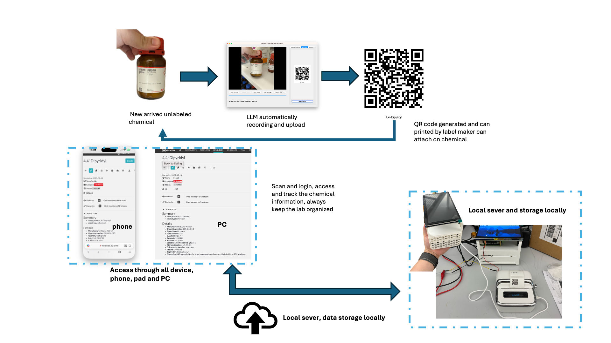

# Lab Asset Manager - Core Backend Module

[](https://www.python.org/downloads/)
[](https://flask.palletsprojects.com/)
[](https://opencv.org/)

<details>
<summary>English</summary>

## 🎯 Module Overview

Lab Asset Manager LLM assited Resources Recording formlism, which can help the user analyze the Chemcial or lab assets images using LLM Visiual model and generate the item in ElabFTW management system directly

### ✨ Core Features

- 🤖 **AI Image Analysis**: Support for multiple LLM providers including OpenAI GPT-4V, Anthropic Claude, and Ollama
- 📷 **Smart Camera Integration**: Real-time image capture, preview, and device recognition
- 🔬 **eLabFTW Integration**: Seamless connection with laboratory information management systems, supporting complete CRUD operations
- 🏷️ **QR Code Management**: Automatic generation and management of asset QR code labels
- 🌐 **Web API Service**: RESTful API interface based on Flask
- ⚙️ **Unified Configuration Management**: Front-end and back-end configuration synchronization, supporting real-time setting updates
- 🔄 **Real-time Communication**: Real-time data transmission based on Socket.IO

### 🏗️ Technical Features

- **Modular Architecture**: Clear module division, easy to maintain and extend
- **Unified Configuration Management**: Eliminate hardcoding, improve system configurability
- **Cross-platform Support**: Support for Windows, macOS, Linux, Raspberry Pi
- **RESTful API**: Standardized API interface design
- **Asynchronous Processing**: Support for long-running AI analysis tasks
- **Error Handling**: Complete exception handling and logging

## System Architecture

### Backend Architecture (Python)
```
lab_asset_manager/
├── config/              # Unified configuration management
├── camera/              # Camera function module
├── elabftw/             # ELabFTW integration module
├── llm/                 # AI analysis module
├── qrcode_module/       # QR code generation module
├── ui/                  # User interface module
└── web/                 # Web service module
```

### Frontend Architecture (Vue.js) (Under Development)
```
web/client/
├── src/
│   ├── components/     # Vue components
│   ├── views/          # Page views
│   ├── services/       # API services
│   ├── store/          # State management
│   └── router/         # Route configuration
└── dist/               # Build output
```

## 🚀 Installation and Configuration

### 📋 Environment Requirements

- **Python**: 3.8+ (3.9+ recommended)
- **Node.js**: 14+ (for frontend development)
- **Operating System**: Windows 10+, macOS 10.15+, Linux (Ubuntu 18.04+), Raspberry Pi OS
- **Hardware**: USB camera (optional), at least 2GB RAM

### ⚡ Quick Installation

```bash
pip install -r requirements.txt
```
Run
```bash
python main.py
```

### 🔧 Detailed Configuration

#### Configuration File Structure

Edit the `config.json` file to configure the following parameters:

```json
{
  "llm": {
    "api_key": "your_openai_api_key",
    "model": "gpt-4-vision-preview",
    "temperature": 0.1,
    "max_tokens": 1000,
    "ollama_url": "http://localhost:11434"
  },
  "elabftw": {
    "api_url": "https://your-elabftw.com/api/v2",
    "api_key": "your_elabftw_api_key",
    "default_category": "1",
    "team_id": "1",
    "hide_token": true,
    "verify_ssl": true
  },
  "camera": {
    "device_id": 0,
    "resolution": [1920, 1080],
    "fps": 30,
    "auto_start": false
  },
  "ui": {
    "theme": "light",
    "language": "en-US"
  },
  "storage": {
    "images_dir": "images",
    "qrcodes_dir": "qrcodes"
  }
}
```

#### 🔑 API Key Configuration

1. **OpenAI API**:
   ```bash
   # Get API key from https://platform.openai.com/
   # Supports GPT-4 Vision model for image analysis
   ```

2. **Anthropic Claude**:
   ```bash
   # Get API key from https://console.anthropic.com/
   # Supports Claude-3 Vision model
   ```

3. **Ollama Local Model**:
   ```bash
   # Install Ollama: https://ollama.ai/
   ollama pull llava:latest  # Local vision model
   ```

4. **eLabFTW Integration**:
   ```bash
   # Generate API key in your eLabFTW instance
   # Path: User Settings -> API Keys
   ```

## Usage

### Starting the System

1. **Start Backend Service**
```bash
python main.py
```

2. **Start Web Service**
```bash
cd web
npm start
```

3. **Access Web Interface**
Open browser and visit: `http://localhost:3000`

### Main Feature Usage

#### 1. Camera Management
- Check camera status: `python camera/camera_status.py`
- Capture image: `python camera/capture_image.py`
- Camera settings: Through web interface or configuration file

#### 2. ELabFTW Integration
- Get experiment templates: `python elabftw/get_templates.py`
- Create experiment items: `python elabftw/create_item.py`
- Update experiment data: `python elabftw/update_item.py`

#### 3. AI Image Analysis
- Analyze image: `python llm/analyze_image.py <image_path>`
- Configure AI model: Edit the llm section in the configuration file

#### 4. QR Code Management
- Generate QR code: `python export_qrcode.py`
- Batch generation: `python export_qrcode_direct.py`
- Simple generation: `python export_qrcode_simple.py`

### Web Interface Features (Under Development)

- **Dashboard**: System status overview
- **Asset Management**: View and manage laboratory assets
- **Camera Control**: Real-time camera preview and control
- **QR Code Generation**: Online generation and management of QR codes
- **Settings**: System configuration and parameter adjustment

## Project Structure

```
lab_asset_manager/
├── __init__.py                    # Project package initialization
├── README.md                      # Project documentation
├── requirements.txt               # Python dependencies list
├── 技术知识点总结.md              # Technical documentation
├── config/                        # Configuration management module
│   ├── __init__.py
│   ├── config.example.json        # Configuration file template
│   ├── config.json                # Actual configuration file
│   ├── paths.py                   # Path management
│   └── settings.py                # Configuration management class
├── camera/                        # Camera function module
│   ├── __init__.py
│   ├── camera_manager.py          # Camera manager
│   ├── camera_settings.py         # Camera settings
│   ├── camera_status.py           # Camera status check
│   ├── capture_image.py           # Image capture
│   ├── get_settings.py            # Settings retrieval
│   └── stream_camera.py           # Camera stream processing
├── elabftw/                       # ELabFTW integration module
│   ├── __init__.py
│   ├── create_item.py             # Create experiment item
│   ├── elab_manager.py            # ELabFTW manager
│   ├── get_item.py                # Get experiment item
│   ├── get_items.py               # Get item list
│   ├── get_settings.py            # Get settings
│   ├── get_templates.py           # Get templates
│   └── update_item.py             # Update experiment item
├── llm/                           # AI analysis module
│   ├── __init__.py
│   ├── analyze_image.py           # Image analysis
│   ├── get_settings.py            # LLM settings retrieval
│   ├── llm_manager.py             # LLM manager
│   └── llm_settings.py            # LLM settings
├── qrcode_module/                 # QR code module
│   ├── __init__.py
│   └── qrcode_generator.py        # QR code generator
├── ui/                            # User interface module
│   ├── __init__.py
│   ├── main_window.py             # Main window
│   └── ui_manager.py              # UI manager
├── web/                           # Web service module
│   ├── README.md                  # Web module documentation
│   ├── package.json               # Node.js dependencies
│   ├── package-lock.json          # Dependency lock file
│   ├── config.json                # Web configuration
│   ├── client/                    # Frontend application
│   │   ├── package.json
│   │   ├── package-lock.json
│   │   ├── dist/                  # Build output
│   │   └── src/                   # Source code
│   │       ├── App.vue            # Main application component
│   │       ├── main.js            # Application entry
│   │       ├── components/        # Vue components
│   │       │   ├── AssetManagementComponent.vue
│   │       │   ├── CameraComponent.vue
│   │       │   ├── ElabFTWComponent.vue
│   │       │   ├── ElabIntegrationComponent.vue
│   │       │   ├── LLMAnalysisComponent.vue
│   │       │   ├── QRCodeComponent.vue
│   │       │   ├── ResponsiveLayout.vue
│   │       │   └── SettingsComponent.vue
│   │       ├── views/             # Page views
│   │       │   ├── AssetsView.vue
│   │       │   ├── CameraView.vue
│   │       │   ├── Dashboard.vue
│   │       │   ├── HomeView.vue
│   │       │   ├── QRCodesView.vue
│   │       │   └── SettingsView.vue
│   │       ├── router/            # Route configuration
│   │       │   └── index.js
│   │       ├── services/          # API services
│   │       │   └── api.js
│   │       └── store/             # State management
│   │           └── index.js
│   └── server/                    # Backend service
│       ├── index.js               # Server entry
│       └── routes/                # API routes
│           ├── camera.js
│           ├── elab.js
│           ├── llm.js
│           └── qrcode.js
├── images/                        # Image storage directory
├── qrcodes/                       # QR code storage directory
├── utils/                         # Utility module
├── elab/                          # ELab bridge module
├── qrcode/                        # QR code bridge module
├── test_function/                 # Test functionality
├── main.py                        # Main program entry
├── export_qrcode.py               # QR code export
├── export_qrcode_direct.py        # Direct QR code export
├── export_qrcode_simple.py        # Simple QR code export
├── fix_qrcode.py                  # QR code fix
├── test_import.py                 # Import test
├── test_qrcode.py                 # QR code test
├── test_qrcode.png                # Test QR code
├── start_web.sh                   # Web startup script
└── lab_asset_manager.log          # System log
```

## Changelog

### v1.0.0 (Current Version)
- Initial version release
- Complete modular architecture
- Unified configuration management system
- Multi-functional API support
- Qt GUI based management

## Contact

If you have any questions or suggestions, please contact:

- Project Issues: [GitHub Issues](project-url/issues)
- Email: lianbin522957@gmail.com

---

**Note**: This document will be continuously updated as the project develops. Please check the latest version regularly.

</details>

<details open>
<summary>中文</summary>

## 🎯 模块概述

Lab Asset Manager 尝试使用 LLM 数据模型来分析实验室资产，用户可以通过拍照的方式来让LLM在elabftw中自动生成对应项目，然后打印二维码


### ✨ 核心功能

- 🤖 **AI图像分析**: 支持OpenAI GPT-4V、Anthropic Claude、Ollama等多种LLM提供商
- 📷 **智能相机集成**: 实时图像捕获、预览和设备识别
- 🔬 **eLabFTW集成**: 与实验室信息管理系统无缝对接，支持完整的CRUD操作
- 🏷️ **二维码管理**: 自动生成和管理资产二维码标签
- 🌐 **Web API服务**: 基于Flask的RESTful API接口
- ⚙️ **统一配置管理**: 前后端配置同步，支持实时设置更新
- 🔄 **实时通信**: 基于Socket.IO的实时数据传输

### 🏗️ 技术特点

- **模块化架构**: 清晰的模块划分，易于维护和扩展
- **统一配置管理**: 消除硬编码，提高系统可配置性
- **跨平台支持**: 支持Windows、macOS、Linux、Raspberry Pi
- **RESTful API**: 标准化的API接口设计
- **异步处理**: 支持长时间运行的AI分析任务
- **错误处理**: 完善的异常处理和日志记录

## 系统架构

### 后端架构 (Python)
```
lab_asset_manager/
├── config/              # 统一配置管理
├── camera/              # 相机功能模块
├── elabftw/            # ELabFTW集成模块
├── llm/                # AI分析模块
├── qrcode_module/      # 二维码生成模块
├── ui/                 # 用户界面模块
└── web/                # Web服务模块
```

### 前端架构 (Vue.js) (开发中----)
```
web/client/
├── src/
│   ├── components/     # Vue组件
│   ├── views/         # 页面视图
│   ├── services/      # API服务
│   ├── store/         # 状态管理
│   └── router/        # 路由配置
└── dist/              # 构建输出
```

## 🚀 安装与配置

### 📋 环境要求

- **Python**: 3.8+ (推荐 3.9+)
- **Node.js**: 14+ (用于前端开发)
- **操作系统**: Windows 10+, macOS 10.15+, Linux (Ubuntu 18.04+), Raspberry Pi OS
- **硬件**: USB摄像头（可选），至少2GB RAM

### ⚡ 快速安装

```bash
pip install -r requirements.txt
```
运行
```bash
python main.py
```

### 🔧 详细配置

#### 配置文件结构

编辑 `config.json` 文件，配置以下参数：

```json
{
  "llm": {
    "api_key": "your_openai_api_key",
    "model": "gpt-4-vision-preview",
    "temperature": 0.1,
    "max_tokens": 1000,
    "ollama_url": "http://localhost:11434"
  },
  "elabftw": {
    "api_url": "https://your-elabftw.com/api/v2",
    "api_key": "your_elabftw_api_key",
    "default_category": "1",
    "team_id": "1",
    "hide_token": true,
    "verify_ssl": true
  },
  "camera": {
    "device_id": 0,
    "resolution": [1920, 1080],
    "fps": 30,
    "auto_start": false
  },
  "ui": {
    "theme": "light",
    "language": "zh-CN"
  },
  "storage": {
    "images_dir": "images",
    "qrcodes_dir": "qrcodes"
  }
}
```

#### 🔑 API密钥配置

1. **OpenAI API**:
   ```bash
   # 在 https://platform.openai.com/ 获取API密钥
   # 支持 GPT-4 Vision 模型进行图像分析
   ```

2. **Anthropic Claude**:
   ```bash
   # 在 https://console.anthropic.com/ 获取API密钥
   # 支持 Claude-3 Vision 模型
   ```

3. **Ollama本地模型**:
   ```bash
   # 安装Ollama: https://ollama.ai/
   ollama pull llava:latest  # 本地视觉模型
   ```

4. **eLabFTW集成**:
   ```bash
   # 在您的eLabFTW实例中生成API密钥
   # 路径: 用户设置 -> API密钥
   ```

## 使用方法

### 启动系统

1. **启动后端服务**
```bash
python main.py
```

2. **启动Web服务**
```bash
cd web
npm start
```

3. **访问Web界面**
打开浏览器访问：`http://localhost:3000`

### 主要功能使用

#### 1. 相机管理
- 查看相机状态：`python camera/camera_status.py`
- 捕获图像：`python camera/capture_image.py`
- 相机设置：通过Web界面或配置文件

#### 2. ELabFTW集成
- 获取实验模板：`python elabftw/get_templates.py`
- 创建实验项目：`python elabftw/create_item.py`
- 更新实验数据：`python elabftw/update_item.py`

#### 3. AI图像分析
- 分析图像：`python llm/analyze_image.py <image_path>`
- 配置AI模型：编辑配置文件中的llm部分

#### 4. 二维码管理
- 生成二维码：`python export_qrcode.py`
- 批量生成：`python export_qrcode_direct.py`
- 简单生成：`python export_qrcode_simple.py`

### Web界面功能 （开发中）

- **仪表板**：系统状态总览
- **资产管理**：查看和管理实验室资产
- **相机控制**：实时相机预览和控制
- **二维码生成**：在线生成和管理二维码
- **设置**：系统配置和参数调整

## 项目结构

```
lab_asset_manager/
├── __init__.py                    # 项目包初始化
├── README.md                      # 项目说明文档
├── requirements.txt               # Python依赖列表
├── 技术知识点总结.md              # 技术文档
├── config/                        # 配置管理模块
│   ├── __init__.py
│   ├── config.example.json        # 配置文件模板
│   ├── config.json               # 实际配置文件
│   ├── paths.py                  # 路径管理
│   └── settings.py               # 配置管理类
├── camera/                        # 相机功能模块
│   ├── __init__.py
│   ├── camera_manager.py         # 相机管理器
│   ├── camera_settings.py        # 相机设置
│   ├── camera_status.py          # 相机状态检查
│   ├── capture_image.py          # 图像捕获
│   ├── get_settings.py           # 设置获取
│   └── stream_camera.py          # 相机流处理
├── elabftw/                       # ELabFTW集成模块
│   ├── __init__.py
│   ├── create_item.py            # 创建实验项目
│   ├── elab_manager.py           # ELabFTW管理器
│   ├── get_item.py               # 获取实验项目
│   ├── get_items.py              # 获取项目列表
│   ├── get_settings.py           # 获取设置
│   ├── get_templates.py          # 获取模板
│   └── update_item.py            # 更新实验项目
├── llm/                          # AI分析模块
│   ├── __init__.py
│   ├── analyze_image.py          # 图像分析
│   ├── get_settings.py           # LLM设置获取
│   ├── llm_manager.py            # LLM管理器
│   └── llm_settings.py           # LLM设置
├── qrcode_module/                # 二维码模块
│   ├── __init__.py
│   └── qrcode_generator.py       # 二维码生成器
├── ui/                           # 用户界面模块
│   ├── __init__.py
│   ├── main_window.py            # 主窗口
│   └── ui_manager.py             # UI管理器
├── web/                          # Web服务模块
│   ├── README.md                 # Web模块说明
│   ├── package.json              # Node.js依赖
│   ├── package-lock.json         # 依赖锁定文件
│   ├── config.json               # Web配置
│   ├── client/                   # 前端应用
│   │   ├── package.json
│   │   ├── package-lock.json
│   │   ├── dist/                 # 构建输出
│   │   └── src/                  # 源代码
│   │       ├── App.vue           # 主应用组件
│   │       ├── main.js           # 应用入口
│   │       ├── components/       # Vue组件
│   │       │   ├── AssetManagementComponent.vue
│   │       │   ├── CameraComponent.vue
│   │       │   ├── ElabFTWComponent.vue
│   │       │   ├── ElabIntegrationComponent.vue
│   │       │   ├── LLMAnalysisComponent.vue
│   │       │   ├── QRCodeComponent.vue
│   │       │   ├── ResponsiveLayout.vue
│   │       │   └── SettingsComponent.vue
│   │       ├── views/            # 页面视图
│   │       │   ├── AssetsView.vue
│   │       │   ├── CameraView.vue
│   │       │   ├── Dashboard.vue
│   │       │   ├── HomeView.vue
│   │       │   ├── QRCodesView.vue
│   │       │   └── SettingsView.vue
│   │       ├── router/           # 路由配置
│   │       │   └── index.js
│   │       ├── services/         # API服务
│   │       │   └── api.js
│   │       └── store/            # 状态管理
│   │           └── index.js
│   └── server/                   # 后端服务
│       ├── index.js              # 服务器入口
│       └── routes/               # API路由
│           ├── camera.js
│           ├── elab.js
│           ├── llm.js
│           └── qrcode.js
├── images/                       # 图像存储目录
├── qrcodes/                      # 二维码存储目录
├── utils/                        # 工具模块
├── elab/                         # ELab桥接模块
├── qrcode/                       # QR码桥接模块
├── test_function/                # 测试功能
├── main.py                       # 主程序入口
├── export_qrcode.py              # 二维码导出
├── export_qrcode_direct.py       # 直接二维码导出
├── export_qrcode_simple.py       # 简单二维码导出
├── fix_qrcode.py                 # 二维码修复
├── test_import.py                # 导入测试
├── test_qrcode.py                # 二维码测试
├── test_qrcode.png               # 测试二维码
├── start_web.sh                  # Web启动脚本
└── lab_asset_manager.log         # 系统日志
```

## 更新日志

### v1.0.0 (当前版本)
- 初始版本发布
- 完整的模块化架构
- 统一配置管理系统
- 多功能API支持
- qtGUI based 管理

## 联系方式 

如有问题或建议，请通过以下方式联系：

- 项目Issues：[GitHub Issues](项目地址/issues)
- 邮箱：lianbin522957@gmail.com

---

**注意**：本文档会随着项目的发展持续更新，请定期查看最新版本。

</details>